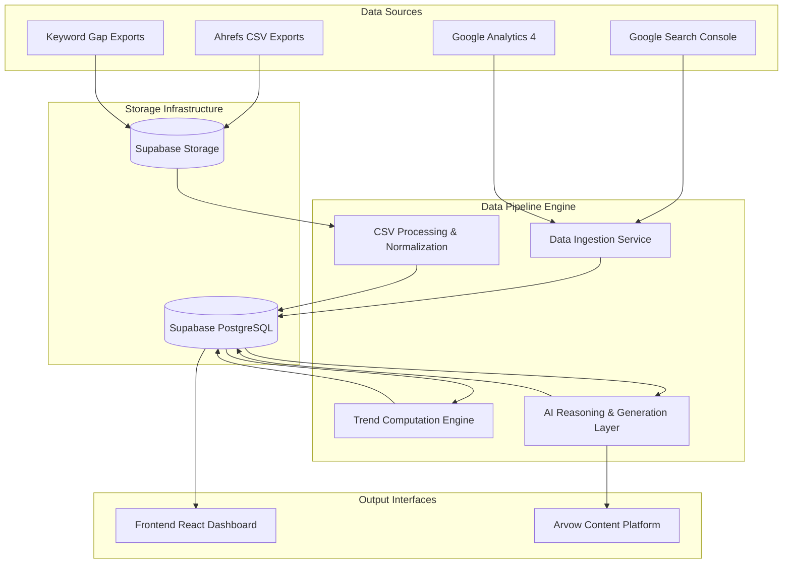
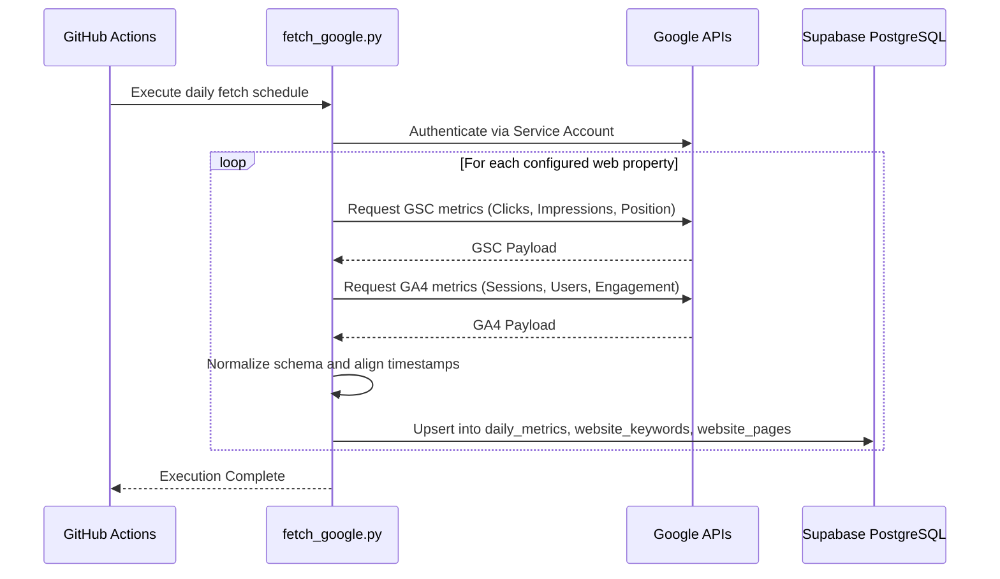
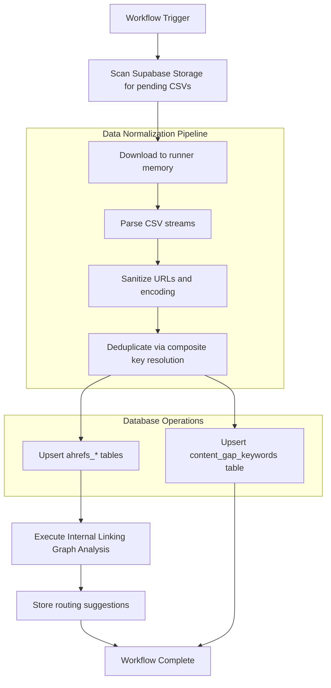
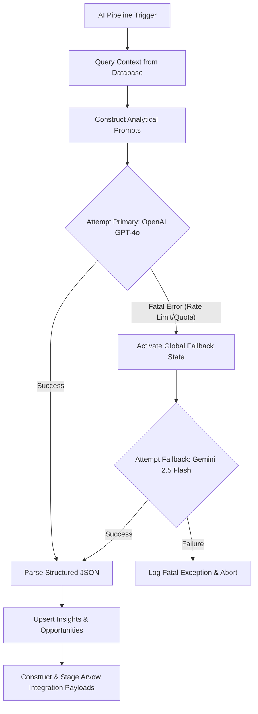

# Ztudium Data Pipeline

The Ztudium Data Pipeline is an automated, high-performance data ingestion and reasoning engine designed to aggregate, process, and analyze search engine optimization (SEO) and web analytics data. The system orchestrates daily extractions from Google APIs, processes bulk SEO exports from Ahrefs, computes localized trends, and utilizes an AI reasoning layer to generate actionable content opportunities and strategic insights.

## Central System Architecture

The architecture is designed with modularity and resilience in mind, leveraging GitHub Actions for orchestration, Supabase for scalable PostgreSQL and object storage, and a dual-provider AI reasoning engine for continuous availability.



## Component Workflows

The pipeline is divided into distinct, decoupled workflows that operate on independent schedules, ensuring fault isolation and scalability.

### 1. Data Ingestion (Google APIs)

The ingestion service performs automated daily extractions of performance and engagement metrics directly from Google Search Console and Google Analytics 4.



**Key Characteristics:**
- **Idempotency:** Utilizes date-based composite keys to ensure safe reruns without duplicating records.
- **Normalization:** Merges disparate API schemas into a unified, query-optimized relational structure.
- **Error Handling:** Implements exponential backoff for transient Google API rate limits.

### 2. Asynchronous CSV Processing (Ahrefs & Keyword Gaps)

Large-scale external SEO data is exported to Supabase Storage and processed asynchronously to extract competitor analysis, broken backlinks, and keyword gaps.



**Key Characteristics:**
- **Batch Processing:** Utilizes chunked upserts to prevent database connection timeouts.
- **Graph Analysis:** The internal linking module analyzes domain structures to suggest optimized link routing between high-authority and low-authority pages.

### 3. Intelligence and Reasoning Layer

The AI reasoning layer is the strategic core of the pipeline. It synthesizes the normalized data to generate daily content briefs, cluster topics, and provide strategic anomaly detection.

To guarantee high availability, the reasoning layer utilizes a custom AI client (`scripts/ai_client.py`) that implements a seamless failover mechanism from OpenAI to Google Gemini.



**Key Characteristics:**
- **Provider Redundancy:** Automatically detects `429 Too Many Requests` or quota exhaustion on the primary provider and seamlessly routes all subsequent requests in the execution context to the fallback provider.
- **Structured Output:** Strictly enforces JSON schema definitions for downstream parsing and database ingestion.
- **Content Automation:** Generates Arvow-compatible payloads containing structured content briefs, internal linking directives, and metadata for one-click publishing.

## Database Schema and State Management

The pipeline relies on a strictly versioned PostgreSQL schema managed via deterministic SQL migrations located in `database/migrations/`.

**Core Tables:**
- `daily_metrics`: Time-series aggregation of GSC and GA4 data.
- `website_keywords` / `website_pages`: Canonical entities for URLs and search queries.
- `content_gap_keywords`: Processed competitor keyword opportunities.
- `daily_content_opportunities`: AI-generated content briefs and Arvow integration payloads.
- `internal_linking_suggestions`: AI-validated routing between source and target URLs.

**Applying Migrations:**
```bash
python database/run_migrations.py
```

## Environment and Configuration

The pipeline requires specific environment variables to authenticate with storage, database, APIs, and AI providers.

| Variable | Scope | Description |
|---|---|---|
| `SUPABASE_URL` | Infrastructure | Endpoint for Supabase Database and Storage. |
| `SUPABASE_SERVICE_KEY` | Infrastructure | Elevated role key for bypassing Row Level Security. |
| `OPENAI_API_KEY` | Intelligence | Primary reasoning model API key. |
| `GEMINI_API_KEY` | Intelligence | Fallback reasoning model API key. |
| `GOOGLE_CREDENTIALS_JSON` | Ingestion | Service account credentials for GSC and GA4 APIs. |
| `ARVOW_API_KEY` | Export | Authentication for the Arvow publishing platform. |
| `ARVOW_INTEGRATION_ID_*` | Export | Platform-specific endpoint identifiers. |

## CI/CD and Automation Operations

Workflows are defined in `.github/workflows/` and operate under specific constraints.

- **`daily-google-fetch.yml`**: Runs daily. Execution time limit: 15 minutes.
- **`process-ahrefs.yml`**: Runs on dispatch. Execution time limit: 60 minutes.
- **`process-keyword-gap.yml`**: Runs on dispatch. Execution time limit: 60 minutes.
- **`daily-content-opportunities.yml`**: Runs daily and chaining off other data processing workflows.

## Troubleshooting and Maintenance

- **Google API Authentication Failures (403):** Verify that the service account email is explicitly added as a delegated owner in the Google Search Console property and Google Analytics 4 property settings.
- **Database Statement Timeouts:** Ensure PostgreSQL indexes defined in `004_indexes_and_constraints.sql` are active. Extremely large CSV files may require adjustments to the chunk size in the processing scripts.
- **AI Payload Generation Failures:** Inspect the `ingestion_runs` table logs. If both OpenAI and Gemini providers exhaust their quotas simultaneously, the execution will abort safely without corrupting database state.
